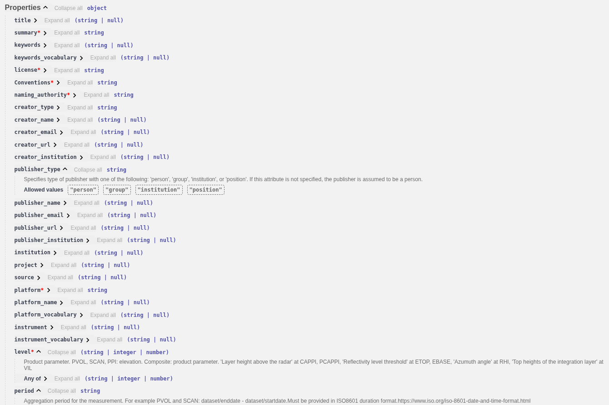

## Data Sharing with ORD Ingest API

The [ORD Ingestion API](https://radar.meteogate.eu/ingest/docs) includes three endpoints for sharing data:


### 1. BUFR Endpoint
- Used for uploading and sharing **BUFR files**.
- For **OPERA to ingest the European single site data** to European Weather Cloud S3 storage
- The ingester module:
  - Extracts metadata from BUFR files and stores it in the database.
  - Uploads the original (or renamed) BUFR file to the ORD S3 bucket.

### 2. ODIM Endpoint
- Processes **ODIM files**.
- For **OPERA to ingest the European single site data and OPERA composites** to European Weather Cloud S3 storage
- The ingester module:
  - Extracts metadata from ODIM files and stores it in the database.
  - Uploads the original (or renamed) ODIM file to the ORD S3 bucket.

### 3. JSON Endpoint
- Enables sharing **locally stored radar data**.
- For **National Meteorological Services (NMSs) to provide national products** via ORD
- Users provide radar metadata through the JSON endpoint.


#### Swagger UI Usage:
1. Klick to "Try it out" button
2. Insert your schema to the textbox
3. Klick to Execute button, and return- code 200 means "Succesfully ingested" 


Error: ``platform`` missing


#### Command line ingest:
```bash
curl -X 'POST' \
  'https://radar.meteogateeu/ingest/json?publishWIS2=false' \
  -H 'accept: application/json' \
  -H 'Content-Type: application/json' \
  -d '{
  "id": "",
  "version": "v4.0",
  "type": "Feature",
  "geometry": {
    "type": "Point",
    "coordinates": {.....
    ...}'
```


## Generate and validate ingest schema with [openradardata-validator](https://github.com/EUMETNET/openradardata-validator)
[Openradardata-validator](https://github.com/EUMETNET/openradardata-validator) includes a JSON message generator for creating custom ``json_upload_schema`` files and a validator script to verify the schema. The message generator creates distinct JSON schemas for each quantity at each level. Generate your schema(s) and customise it.

## Make the upload schema manually
Scroll down and check the properties in the Schemas box.
 


1. ``coordinates``:
    - Single site: use site coordinates
    - Composite: use the central(math average) point coordinates. (Corner coordinates TBD) 
2. ``platform``:
    - Single site data: use the existing Wigos Id of radar
    - Composite data: generate a unique id for your each grid, for example: 0-578-0-S_Norway_Comp_v1 , where:
        - 578: Norway ISO country code
        - S_Norway_Comp_v1: unique ID. Max length 16, the use of '-' character is not allowed.
3. ``license``:  https://creativecommons.org/licenses/by/4.0/ (for example)
4. ``level``: Use ODIM product parameter(if exists) or 0
    - PVOL, SCAN, PPI: elevation
    - Composite: product parameter
    - CAPPI, PCAPPI: 'Layer height above the radar
    - ETOP, EBASE: Reflectivity level threshold
    - RHI: Azumuth angle
    - VIL: Top heights of the integration layer
5. ``function``: point
6. datetime, two allowed options:
    - ``start_datetime`` and ``end_datetime``: format example: '2025-10-14T07:55:00Z'
    - ``datetime`` and ``period``: ``datetime`` is the ``end_datetime``. The period in ISO8601 duration format, for example: 
        - 'PT30S': 30 second
        - 'PT45M': 45 minutes
        - 'PT1H': one hour
7. ``format``: BUFR, ODIM, GeoTIFF
8. ``radar_meta``: set the ODIM attributes, including the image corner coordinates
9. ``hamsl``: height of station
10. ``content``:
    - ``value``: 0
    - ``standard_name``: ODIM quantity
    - ``unit``: '%'
    - ``size``: '1'
    - ``encoding``: 'utf-8'
11. ``links``:
    - add general link for your institution, or API:
        ```json
        {
            "href": "https://en.ilmatieteenlaitos.fi/radar-data-on-aws-s3",
            "rel": "service-desc",
            "type": "application/geo+json",
            "hreflang": "en",
            "title": "FMI Radar Data on AWS"
        }
        ```
    - for the direct data access add at least one link with the ``item`` or ``items`` property. For exanple:
        ```json
        {
            "href": "https://rgw.met.no/f6e82026a94d490aba8481274757556e:stacapi-radar-production/Mosaic-Norway-v1/2025/10/15/norway_pcappi_class-dbz-1000_202510151035.tiff",
            "rel": "item",
            "type": "image/tiff; application=geotiff; profile=cloud-optimized",
            "title": "Data"
        }
        ```
