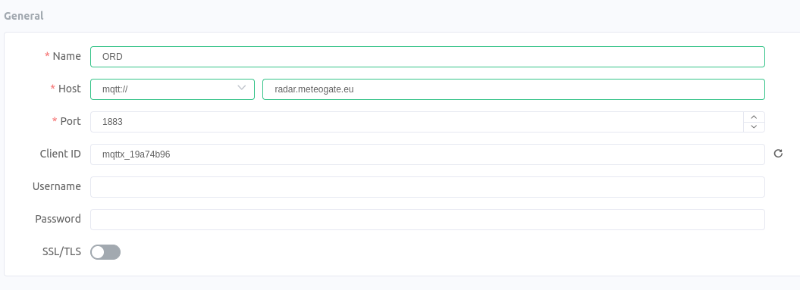

# Subscribe to ORD with MQTTX

This guide explains how to subscribe to an MQTT stream using **MQTTX**, a user-friendly MQTT client for desktop applications. Follow the steps below to set up a connection and start listening to an MQTT topic.

## MQTT Stream Details

- **Protocol**: `mqtt://`
- **Host**: `radar.meteogate.eu`
- **Port**: `1883`
- **SSL/TLS**: Not required (unencrypted connection)
- **Authentication**: None (anonymous connection, no username or password)
- **Topics**: Choose or specify the topic you want to subscribe to (e.g., `ORD/no.met`). Use the wildcard `#` to subscribe to all topics.

---

## Prerequisites

1. Download and install the **MQTTX** client from the official website:
   - [Download MQTTX](https://mqttx.app/)

2. Install and launch MQTTX on your computer.

---

## Step-by-Step Guide

### Step 1: Launch MQTTX and Create a New Connection

1. Open the MQTTX application.
2. Click the **+ New Connection** button in the left sidebar.
3. Fill in the connection details:
   - **Client ID**: Provide a unique identifier for your client (e.g., `mqttx_client_1`).
   - **Host**: `radar.meteogate.eu`
   - **Port**: `1883`
   - **Protocol**: `MQTT` (not `MQTTS`, as SSL/TLS is not required).
   - **Username**: Leave this blank (no authentication required).
   - **Password**: Leave this blank (no authentication required).

4. Click **Connect** to establish the connection. The status of the connection will change to **Connected** if successful.

---

### Step 2: Subscribe to a Topic

1. Once connected, navigate to the **Subscriptions** tab in MQTTX.
2. Click the **+ New Subscription** button.
3. Enter the topic you want to subscribe to in the **Topic** field:
   - Example: `ORD/no.met/#`
   - Use `#` to subscribe to all topics.
4. Click **Subscribe**.

---

### Step 3: View Incoming Messages

1. Any messages published to the subscribed topic(s) will appear in the **Messages** tab.
2. The messages include both the topic name and the payload (data sent within the message).
3. The direct link is the link section(rel="item")

