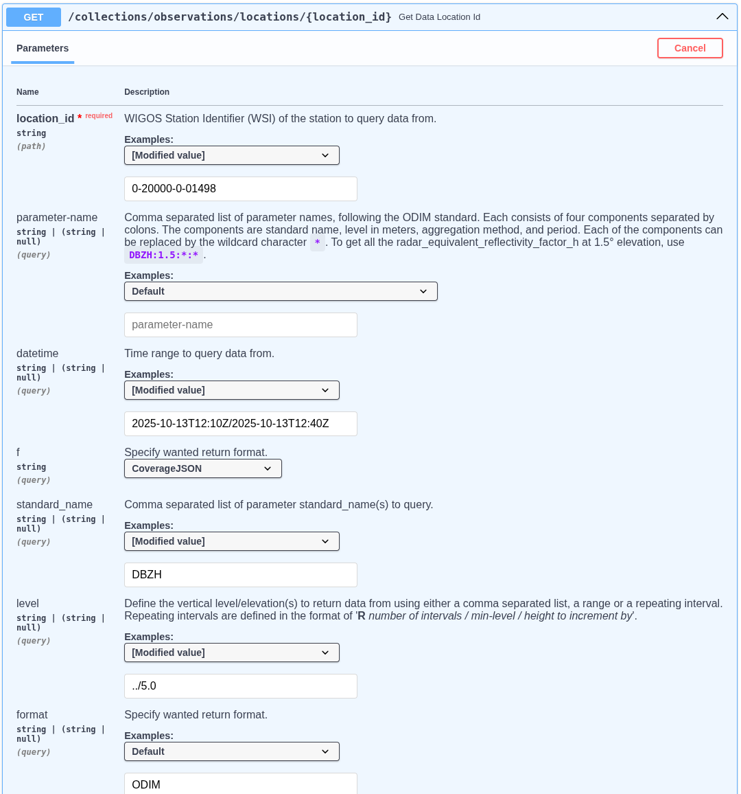
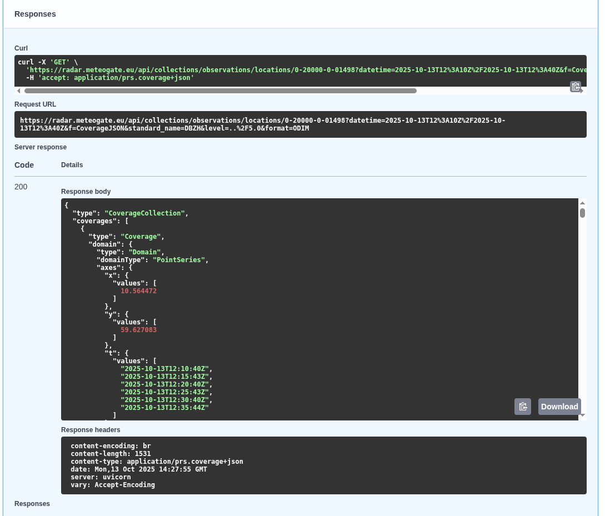
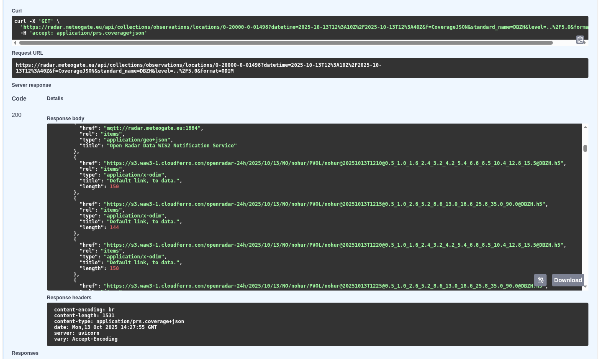
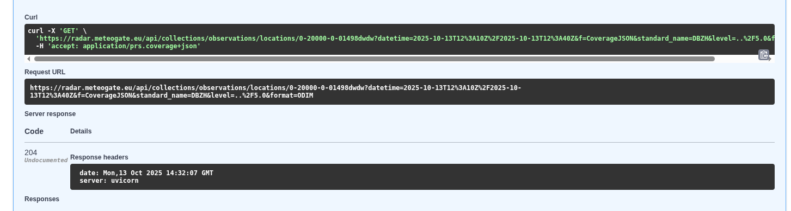

# Open Radar API Documentation


## RODEO

The [RODEO project](https://rodeo-project.eu/) develops a user interface and Application Programming Interfaces (API) for accessing meteorological datasets declared as High Value Datasets (HVD) by the EU Implementing Regulation (EU) 2023/138 under the EU Open Data Directive (EU) 2019/1024. The project also fosters the engagement between data providers and data users for enhancing the understanding of technical solutions being available for sharing and accessing the HVD datasets.
This project provides a sustainable and standardized system for sharing real-time ~surface weather observations~ **weather radar observations** in line with the HVD regulation and WMO WIS 2.0 strategy. The real-time ~surface weather observations~ **weather radar observations** are made available through open web services, so that they can be accessed by anyone.

# Open Radar Data (ORD)

The weather radar data is also considered as HVDs, and therefore, one of the goals of RODEO is to supply near real-time weather radar observations. The radar data will be published on both a message queue using [MQTT](https://mqtt.org/) and [EDR](https://ogcapi.ogc.org/edr/) compliant APIs. Metadata will also be made available through [OGC Records](https://ogcapi.ogc.org/records/) APIs. The system architecture is portable, scalable and modular for taking into account possible future extensions to existing networks and datasets. Diagrams of the system could be found here as [C4 diagrams](https://github.com/EUMETNET/openradardata-technical-architecture/tree/ingest/source/images/c4-container-openradar-wp6-user.png).


The **Open Radar API** enables users to access radar data for visualization, analysis, and integration into other systems. The **Ingest API** focuses on data ingestion, allowing users to provide local stored data(**ODIM**, **GeoTIFF**) references. The API stored the latest 24h radar data. The archive system....(TBD) 
[Open Radar Data API](https://radar.meteogate.eu/api/) and the related [Open Radar Data Ingest API](https://radar.meteogate.eu/ingest/) is located at [European Weather Cloud](https://europeanweather.cloud/). The ODIM files available at the S3 Bucket [openradar-24h](https://s3.waw3-1.cloudferro.com/openradar-24h/). The ORD API is also available from [meteogate.eu](https://api.meteogate.eu/ord/edr)


## Published datasets in ORD
There are three types of data available via ORD.
1. European single-site radar data are available through the EUMETNET OPERA programme, both as a 24-hour rolling cache and as an extensive archive. The data are provided in BUFR format for older datasets and in ODIM HDF5 format for more recent ones.
2. European composite products — including maximum reflectivity factor, instantaneous rain rate, and 1-hour rainfall accumulation — are available both as a 24-hour rolling cache and as a long-term archive dating back to 2012. These products are provided by the EUMETNET OPERA programme in ODIM HDF5 and cloud-optimized GeoTIFF formats.
3. National radar product, e.g. national radar composites, rain rate composites, accumulation products, and echo tops. These are provided as a link to be downloaded from the national interfaces, and typically in ODIM HDF5 or cloud-optimized GeoTiffs.

---
## Getting Started

1. Visit the Swagger UI for the **Open Radar API** ([here](https://radar.meteogate.eu/api/docs)) and the **Ingest API** ([here](https://radar.meteogate.eu/ingest/docs)) to explore the endpoints and capabilities.


## Data Retrieval with ORD API

### Open Radar API Examples

The **Open Radar API** is ideal for retrieving and integrating radar data into various workflows. Here are some examples:

1. **Single site:**
   - Retrieve single site(Hurum, Norway) radar intensity data(DBZH) in ODIM format for specific time range(2025-10-13T12:10Z/2025-10-13T12:40Z) and elevations lower than 5&deg;:
        1. Open [ORD API](https://radar.meteogate.eu/api/docs) and select: collections/observations/localtions/{location_id}
        2. Click to "Try it out" button and set the query parameters:
        3. ``location_id``: 0-20000-0-01498
        4. ``parameter-name``: leave blank, set it below separately(standard_name:level:*:*)
        5. ``datetime``: 2025-10-13T12:10Z/2025-10-13T12:40Z
        6. ``standard_name``: DBZH
        7. ``level``: ../5.0
        8. ``format``: ODIM
        9. ``method`` and ``duration`` are blank

            

        10. Click the Execution button and the response available. See the ``curl`` example the request url and the response below

            

        11. ODIM data are downloadable from these links:
            

        12. radar_meta(ODIM attributes) section is below the links:
            ```json
                "metocean:wigosId": "0-20000-0-01498",
                "metocean:platform_name": "[nohur]",
                "metocean:format": "ODIM",
                "metocean:radar_meta": {
                    "object": "PVOL",
                    "elangle": 1,
                    "nbins": 960,
                    "rstart": 0,
                    "rscale": 250,
                    "nrays": 360,
                    "a1gate": 338,
                    "product": "SCAN",
                    "beamwH": 0.95
                }
            ```
        13. If no data for the specified query the response is 204.

            

   - Query Radial velocity volumes:
        1. ``standard_name``: VRADH

   - Retrieve all Finnish data.
        1. ``location_id``: 0-246-\*-\*

2. **Composites:**
   - Use radar precipitation data for hydrological modeling and flood prediction.
        1. ``standard_name``: RATE or ACRR

   - OPERA products:
        1. ``location_id``: 0-\*-\*-OPERA

   - Query GeoTIFF format:
        1. ``format``: GeoTIFF

3. **Observation items:**
   - Retrieve german sites from boundary box area (-5.5,18.0,72.0,82.1) where radar intensity data(TH) is available in ODIM format for specific time range(2025-10-13T12:10Z/2025-10-13T12:40Z):
        1. Open [ORD API](https://radar.meteogate.eu/api/docs) and select: collections/observations/items
        2. Click to "Try it out" button and set the query parameters:
        3. ``bbox``: -5.5,18.0,72.0,82.1
        4. ``datetime``: 2025-10-13T12:10Z/2025-10-13T12:40Z
        5. ``id``: leave blank
        6. ``parameter-name``: leave blank, set it below separately(standard_name:level:*:*)
        7. ``naming_authority``: de.dwd
        8. ``institution``, ``platform``: leave blank
        9. ``standard_name``: TH
        10. ``unit``, ``instrument``, ``level``: leave blank
        11. ``format``: ODIM,
        12. ``period``, ``method``, ``f``: leave blank
        Result 
        ```json
            {
            "type": "FeatureCollection",
            "features": [
                {
                "type": "Feature",
                "geometry": {
                    "type": "Point",
                    "coordinates": [
                    9.694533,
                    52.460083
                    ]
                },
                "properties": {
                    "summary": "Radar data from OPERA network.",
                    "license": "https://creativecommons.org/licenses/by/4.0/",
                    "naming_authority": "de.dwd",
                    "platform": "0-20000-0-10339",
                    "platform_name": "[dehnr]",
                    "standard_name": "TH",
                    "unit": "%",
                    "level": 0.5,
                    "period": "PT30S",
                    "parameter_name": "TH:0.5:point:PT30S",
                    "timeseries_id": "07ea52bf21af5399cbc165982559d2ea",
                    "radar_meta": {
                    "object": "SCAN",
                    "elangle": 0.4998779296875,
                    "nbins": 720,
                    "rstart": 0,
                    "rscale": 250,
                    "nrays": 360,
                    "a1gate": 100,
                    "product": "SCAN",
                    "frequency": 5641692508.103789,
                    "beamwH": 0.9,
                    "beamwV": 0.9
                    },
                    "format": "ODIM",
                    "platform_vocabulary": "https://oscar.wmo.int/surface/rest/api/search/station?wigosId=0-20000-0-10339",
                    "method": "point",
                    "data": "https://radar.meteogate.eu/api/collectionscollections/observations/locations/0-20000-0-10339?=parameter-name=TH:0.5:point:PT30S"
                },
                "id": "07ea52bf21af5399cbc165982559d2ea"
                },
                {
                "type": "Feature",
                "geometry": {
                    "type": "Point",
                    "coordinates": [
                    6.967111,
                    51.405649
                    ]
                },
                "properties": {
                    "summary": "Radar data from OPERA network.",
                    "license": "https://creativecommons.org/licenses/by/4.0/",
                    "naming_authority": "de.dwd",
                    "platform": "0-20000-0-10410",
                    "platform_name": "[deess]",
                    "standard_name": "TH",
                    "unit": "%",
                    "level": 0.5,
                    "period": "PT30S",
                    "parameter_name": "TH:0.5:point:PT30S",
                    "timeseries_id": "126aad398d3e52c3151a5cc5f7a0ffb2",
                    "radar_meta": {
                    "object": "SCAN",
                    "elangle": 0.4998779296875,
                    "nbins": 720,
                    "rstart": 0,
                    "rscale": 250,
                    "nrays": 360,
                    "a1gate": 100,
                    "product": "SCAN",
                    "frequency": 5606682004.950664,
                    "beamwH": 0.9,
                    "beamwV": 0.9
                    },
                    "format": "ODIM",
                    "platform_vocabulary": "https://oscar.wmo.int/surface/rest/api/search/station?wigosId=0-20000-0-10410",
                    "method": "point",
                    "data": "https://radar.meteogate.eu/api/collectionscollections/observations/locations/0-20000-0-10410?=parameter-name=TH:0.5:point:PT30S"
                },
                "id": "126aad398d3e52c3151a5cc5f7a0ffb2"
                },...
            ]...
            }

        ```
        
---
## Data Sharing with Ingest API

The ORD ingestion API includes three endpoints for sharing data:

### 1. BUFR Endpoint
- Used for uploading and sharing **BUFR files**.
- For **OPERA to ingest the European single site data** to European Weather Cloud S3 storage
- The ingester module:
  - Extracts metadata from BUFR files and stores it in the database.
  - Uploads the original (or renamed) BUFR file to the ORD S3 bucket.

### 2. ODIM Endpoint
- Processes **ODIM files**.
- For **OPERA to ingest the European single site data and OPERA composites** to European Weather Cloud S3 storage
- The ingester module:
  - Extracts metadata from ODIM files and stores it in the database.
  - Uploads the original (or renamed) ODIM file to the ORD S3 bucket.

### 3. JSON Endpoint
- Enables sharing **locally stored radar data**.
- For **National Meteorological Services (NMSs) to provide national products** via ORD
- Users provide radar metadata through the JSON endpoint.


**[Openradardata-validator](https://github.com/EUMETNET/openradardata-validator)** includes a JSON message generator for creating custom `json_upload_schema` files and a validator script to verify the schema. The message generator creates distinct JSON schemas for each quantity at each level.

---

### Ingest API Use Cases

The **Ingest API** is designed for uploading and processing radar data files. It supports the ingestion of **ODIM** and **BUFR** data formats as well as local file references via JSON.

Examples: TBD

