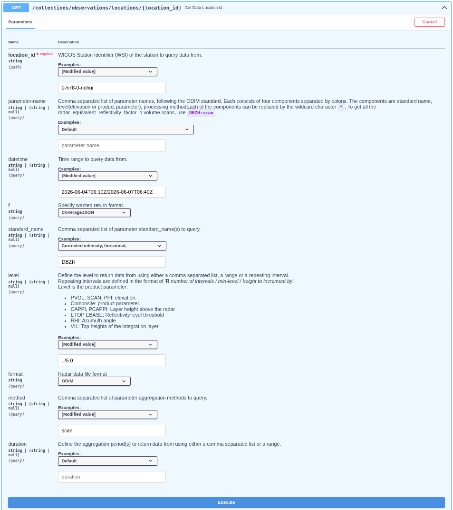
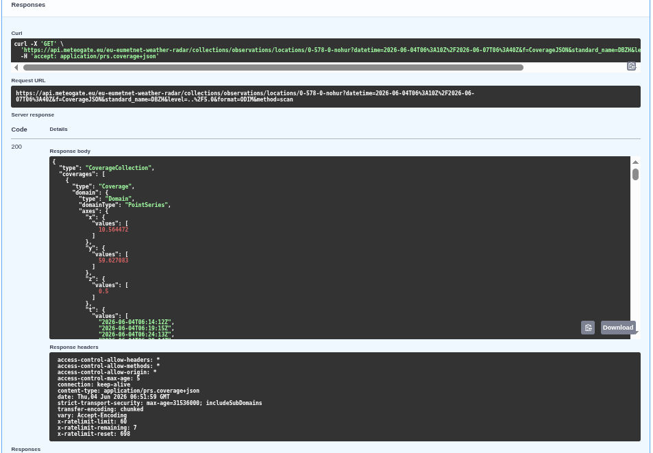
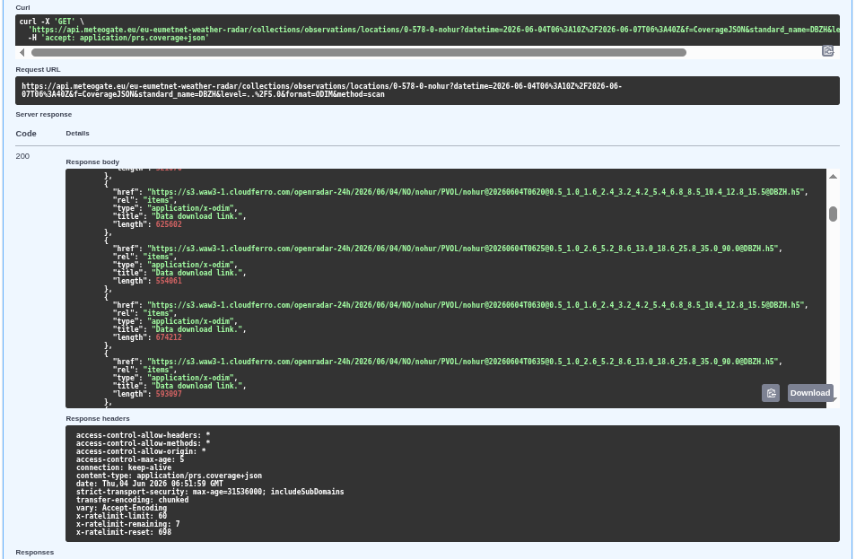
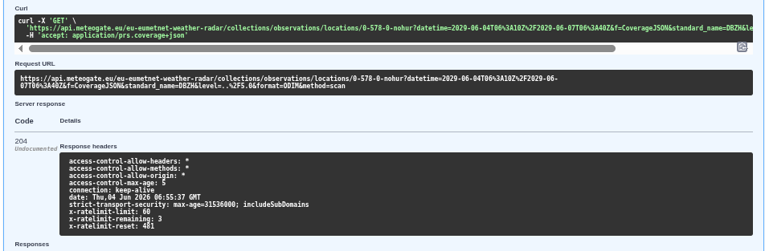

## Data Retrieval with Open Radar Data (ORD) API

---
## Please note: ORD API onboarding on MeteoGate is finalised on May 20th, and whitelisting is no longer needed.

With the onboarding completed, access for ORD API will be provided through **MeteoGate**. More information can be found in the [newsletter](https://github.com/EUMETNET/openradardata-documentation/raw/main/docs/attachments/ORD_API_newsletter_20052026_vs2.pdf).

With this transition, please note the changes in the access point addresses and notification service port, the following ORD services are now openly available:

- [ORD API via MeteoGate Gateway](https://api.meteogate.eu/eu-eumetnet-weather-radar)
- [ORD API swagger UI](https://api.meteogate.eu/eu-eumetnet-weather-radar/docs)  
- [Notification service](https://eumetnet.github.io/openradardata-documentation/4-ORD-API-subscribing-MQTTX/): The MQTT connection parameters have changed: username: everyone, port: 8884

---

### [Data available in ORD API](https://github.com/EUMETNET/openradardata-documentation/blob/main/docs/1-ORD-API-overview.md#published-datasets-in-ord-api)

**1. EUMETNET OPERA single-site volume radar data**
  
  - 24-hour rolling cache, with a long-term archive (2012–, TBD)
  - Formats: BUFR (older) and ODIM HDF5 (recent)
  - License: CC BY 4.0 (with exceptions noted in metadata)
  - Currently mainly includes:
    - DBZH (Doppler-filtered horizontal reflectivity factor, with national QC applied)
    - TH (unfiltered horizontal reflectivity factor)
    - VRADH (horizontal radial velocity)
  - Basic dual-pol variables (e.g. correlation coefficient, differential reflectivity, differential phase shift, specific differential phase) are planned to be added from 2027 onwards (TBD)

**2. EUMETNET OPERA composite products**
   
   - Products: maximum reflectivity, instantaneous rain rate, 1-hour accumulation
   - 24-hour rolling cache, with a long-term archive (2012– )
   - Formats: ODIM HDF5 and cloud-optimized GeoTIFF
   - License: CC BY 4.0
     
**3. National radar products**

  - Examples of national composites, rain rate composites, accumulations, echo tops
  - Access: via links to national interfaces (24h access of links)
  - Formats: ODIM HDF5 or cloud-optimized GeoTIFF

---

### ORD API Examples

The **Open Radar Data API** is ideal for retrieving and integrating radar data into various workflows. Here are some examples:

**1. EUMETNET OPERA single-site volume radar data:**

   - Retrieve single site (Hurum, Norway) radar intensity data (DBZH) in ODIM format for specific time range (2026-06-04T06:10Z/2026-06-04T06:40Z) and elevations lower than 5&deg;:

     i. Open [ORD API Swagger UI](https://api.meteogate.eu/eu-eumetnet-weather-radar/docs) and select: collections/observations/localtions/{location_id}

     ii. Click to "Try it out" button and set the query parameters:

     iii. ``location_id``: 0-578-0-nohur
        
     iv. ``parameter-name``: leave blank, set it below separately(standard_name:level:*:*)
        
     v. ``datetime``: 2026-06-04T06:10Z/2026-06-07T06:40Z
        
     vi. ``standard_name``: DBZH
        
     vii. ``level``: ../5.0

     viii. ``format``: ODIM

     ix. ``method``: scan 

     x. ``duration`` is blank

       

      Note: Location id is `0-578-0-nohur`, where `578` is the ISO country code of Norway, and `nohur` is a unique ODIM code. You can find the full list of the codes [here](https://github.com/EUMETNET/openradardata-validator/blob/main/src/openradardata_validator/stations/OPERA_RADARS.csv).

     xi. Click the Execution button and the response available. See the ``curl`` example the request url and the response below

       

      Note: Check the `x-ratelimit-remaining` value for remaining(anonymous) queries! Get API keys at [Meteogate Developer Portal](https://devportal.meteogate.eu/)

     xii. Direct meteogate query link:
     
       ```
       https://api.meteogate.eu/eu-eumetnet-weather-radar/collections/observations/locations/0-578-0-nohur?datetime=2026-06-04T06%3A10Z%2F2026-06-04T06%3A40Z&f=CoverageJSON&level=..%2F5.0&format=ODIM
       ```
      Note: Update the datetime field within this URL. 
     
     xiii. ODIM data are downloadable from these links:
        
       

      xiv. Using [aws](https://aws.amazon.com/cli/) tool

            Check the file existing in the S3 bucket:
            ```bash
            aws s3 ls s3://openradar-24h/2026/06/04/NO/nohur/PVOL/   --endpoint-url https://s3.waw3-1.cloudferro.com/  --no-sign-request
            ```
            Check the daily OPERA data in the S3 bucket:
            ```bash
            aws s3 ls s3://openradar-24h/2026/04/06/OPERA/COMP/   --endpoint-url https://s3.waw3-1.cloudferro.com/  --no-sign-request
            ```
            Copy file to new_local_filename.h5:
            ```bash
            aws s3  cp s3://openradar-24h/2026/06/04/OPERA/COMP/OPERA@20260604T0220@0@DBZH.h5 ./new_local_filename.h5  --endpoint-url https://s3.waw3-1.cloudferro.com/  --no-sign-request
            ```

     xv. radar_meta(ODIM attributes) section is below the links:
         
            ```json
                "metocean:wigosId": "0-578-0-honur",
                "metocean:platform_name": "[nohur]",
                "metocean:format": "ODIM",
                "metocean:radar_meta": {
                    "object": "PVOL",
                    "elangle": 1,
                    "nbins": 960,
                    "rstart": 0,
                    "rscale": 250,
                    "nrays": 360,
                    "a1gate": 338,
                    "product": "SCAN",
                    "beamwH": 0.95
                }
            ```
        
      xvi. If no data for the specified query the response is 204.

       
            
   - Query Radial velocity volumes:

     i. ``standard_name``: VRADH

   - Retrieve all Dutch data.

     i. ``location_id``: 0-528-\*-nl\*

<br>

**2. OPERA composite products:**

   - Fetch composite product from OPERA production
     
     i. ``standard_name``: RATE or ACRR or DBZH

   - OPERA products:
     
     i. ``location_id``: 0-20010-0-OPERA

   - Query ODIM format:
     
     i. ``format``: ODIM

   - Composite:
     
     i. ``method``: comp

<br>

**3. Select observation items:**

   - Retrieve German sites from boundary box area (-5.5,18.0,72.0,82.1) where raw radar reflectivity data (TH) is available in ODIM format for specific time range (2026-06-04T02:10Z/2026-06-04T02:40Z):

       i. Open [ORD API](https://api.meteogate.eu/eu-eumetnet-weather-radar/docs) and select: collections/observations/items

       ii. Click to "Try it out" button and set the query parameters:

       iii. ``bbox``: -5.5,18.0,72.0,82.1

       iv. ``datetime``: 2026-06-04T02:10Z/2026-06-04T02:40Z

       v. ``id``: leave blank

       vi. ``parameter-name``: leave blank, set it below separately (standard_name:level:*:*)

       vii. ``naming_authority``: de.dwd

       viii. ``institution``, ``platform``: leave blank

       ix. ``standard_name``: TH

       x. ``unit``, ``instrument``, ``level``: leave blank

       xi. ``format``: ODIM,

       xii. ``method``: scan

       xiii. ``period``, ``f``: leave blank

         Result 
          ```json
          {
            "type": "FeatureCollection",
            "features": [
              {
                "type": "Feature",
                "geometry": {
                  "type": "Point",
                  "coordinates": [
                    6.967111,
                    51.405649,
                    2.5
                  ]
                },
                "properties": {
                  "summary": "Radar data from OPERA network.",
                  "license": "https://creativecommons.org/licenses/by/4.0/",
                  "naming_authority": "de.dwd",
                  "platform": "0-276-0-deess",
                  "platform_name": "[deess]",
                  "standard_name": "TH",
                  "unit": "%",
                  "level": 2.5,
                  "period": "PT1M",
                  "parameter_name": "TH:scan",
                  "timeseries_id": "008d7bb60bda9936afc1361e8c2003ae",
                  "radar_meta": {
                    "object": "SCAN",
                    "elangle": 2.4993896484375,
                    "nbins": 720,
                    "rstart": 0,
                    "rscale": 250,
                    "nrays": 360,
                    "a1gate": 80,
                    "product": "SCAN",
                    "frequency": 5606682004.950664,
                    "beamwH": 0.9,
                    "beamwV": 0.9
                  },
                  "format": "ODIM",
                  "platform_vocabulary": "https://oscar.wmo.int/surface/rest/api/search/station?wigosId=0-276-0-deess",
                  "method": "scan",
                  "data": "https://api.meteogate.eu/eu-eumetnet-weather-radar/collections/observations/locations/0-276-0-deess?parameter-name=TH:scan&level=2.5&format=ODIM"
                },
                "id": "008d7bb60bda9936afc1361e8c2003ae"
              },
              {
                "type": "Feature",
                "geometry": {
                  "type": "Point",
                  "coordinates": [
                    8.712933,
                    49.984745,
                    5.5
                  ]
                },
                "properties": {
                  "summary": "Radar data from OPERA network.",
                  "license": "https://creativecommons.org/licenses/by/4.0/",
                  "naming_authority": "de.dwd",
                  "platform": "0-276-0-deoft",
                  "platform_name": "[deoft]",
                  "standard_name": "TH",
                  "unit": "%",
                  "level": 5.5,
                  "period": "PT1M",
                  "parameter_name": "TH:scan",
                  "timeseries_id": "038fe46ffe011e26536f9e45c88a91b2",
                  "radar_meta": {
                    "object": "SCAN",
                    "elangle": 5.4986572265625,
                    "nbins": 720,
                    "rstart": 0,
                    "rscale": 250,
                    "nrays": 360,
                    "a1gate": 54,
                    "product": "SCAN",
                    "frequency": 5641692508.103789,
                    "beamwH": 0.9,
                    "beamwV": 0.9
                  },
                  "format": "ODIM",
                  "platform_vocabulary": "https://oscar.wmo.int/surface/rest/api/search/station?wigosId=0-276-0-deoft",
                  "method": "scan",
                  "data": "https://api.meteogate.eu/eu-eumetnet-weather-radar/collections/observations/locations/0-276-0-deoft?parameter-name=TH:scan&level=5.5&format=ODIM"
                },
                "id": "038fe46ffe011e26536f9e45c88a91b2"
              },...
                      ]...
                      }
      ```


