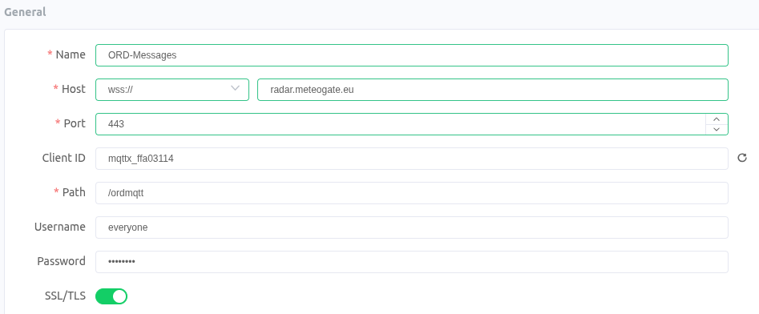
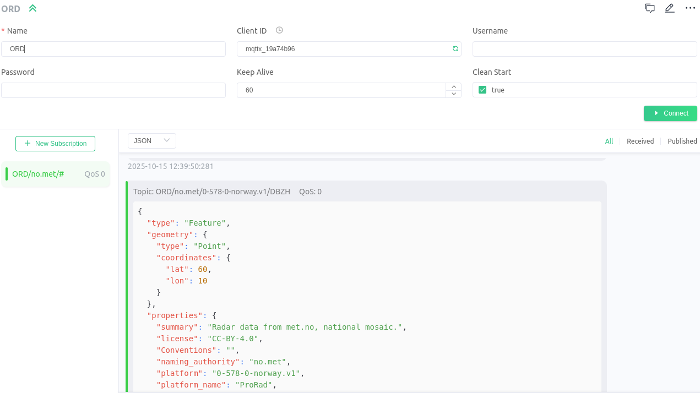

# Subscribe to ORD with MQTTX

This guide explains how to subscribe to an MQTT stream using **MQTTX**, a user-friendly MQTT client for desktop applications. Follow the steps below to set up a connection and start listening to an MQTT topic.

---
## Please note: ORD API onboarding on MeteoGate is delayed, to access radar data and products whitelisting is recommended.

Currently, access to data and products via the **ORD API** can be arranged by whitelisting users’ IP addresses or IP address ranges. Requests should be sent to support.opera[at]eumetnet.eu, and access will be enabled accordingly.

This procedure was originally established for the pre-operational phase and remains in place due to a delay in onboarding the ORD API to MeteoGate. Please note that the data and product provision itself is fully operational; only the access process has not yet been fully implemented through MeteoGate. In the meantime, users are kindly requested to provide their IP address details for whitelisting in order to access the data. We sincerely apologise for any inconvenience this temporary arrangement may cause and appreciate your understanding. We are actively working on a solution and expect to make the ORD API available via MeteoGate in the coming weeks.

Once onboarding has been completed, access will be provided through **MeteoGate**, which serves as a one-stop shop for meteorological and hydrological products and data. Further information is available on the MeteoGate website:  [MeteoGate](https://meteogate.eu/)).

---

## MQTT Stream Details

- **Protocol**: `wss://`
- **Host**: `radar.meteogate.eu`
- **Port**: `443`
- **Path**: `/ordmqtt`
- **SSL/TLS**: `Yes`
- **Authentication**
   - **username**: `everyone`
   - **password**: `everyone`
- **Topics**: The topics hierarchy is the following: `ORD/naming_authority/wigosId/quantity`. Choose or specify the topic you want to subscribe. 
   - **Examples**
      - Subscribe Hurum DBZH data: `ORD/no.met/0-578-0-nohur/DBZH`
      - Subscribe all Finnish DBZH data: `ORD/fi.fmi/+/DBZH`
      - Subscribe OPERA accumulated precipitation: `ORD/eu.eumetnet/0-20010-0-OPERA/ACRR`
      - Subscribe OPERA product: `ORD/eu.eumetnet/#`
      - Use the wildcard `#` to subscribe to all topics. 

### This access mode is deprecated and will be removed in future versions
- **Protocol**: `mqtt://`
- **Host**: `radar.meteogate.eu`
- **Port**: `1883`
- **SSL/TLS**: Not required (unencrypted connection)
- **Authentication**: None (anonymous connection, no username or password)

## WIS 2.0 MQTT Stream Details (Metadata only)

- **Protocol**: `wss://`
- **Host**: `radar.meteogate.eu`
- **Port**: `443`
- **Path**: `/wis2mqtt`
- **SSL/TLS**: `Yes`
- **Authentication**
   - **username**: `everyone`
   - **password**: `everyone`
- **Topics**: 
   - **Metadata**: `origin/a/wis2/eu-eumetnet-weather-radar/metadata/core/weather/experimental/weather-radar`
   - **Data**: `origin/a/wis2/eu-eumetnet-weather-radar/data/core/weather/experimental/weather-radar`

---

## Prerequisites

1. Download and install the **MQTTX** client from the official website:
   - [Download MQTTX](https://mqttx.app/)

2. Install and launch MQTTX on your computer.

---

## Step-by-Step Guide

### Step 1: Launch MQTTX and Create a New Connection

1. Open the MQTTX application.
2. Click the **+ New Connection** button in the left sidebar.
3. Fill in the connection details:
   - **Client ID**: Provide a unique identifier for your client (e.g., `mqttx_client_1`).
   - **Host**: `radar.meteogate.eu`
   - **Port**: `443`
   - **Protocol**: `wss` Secure websocket
   - **SSL/TLS**: `On`
   - **Path**: `/ord2mqtt`
   - **Username**: `everyone`
   - **Password**: `everyone`

4. Click **Connect** to establish the connection. The status of the connection will change to **Connected** if successful.

---

### Step 2: Subscribe to a Topic

1. Once connected, navigate to the **Subscriptions** tab in MQTTX.
2. Click the **+ New Subscription** button.
3. Enter the topic you want to subscribe to in the **Topic** field:
   - Example: `ORD/no.met/#`
   - Use `#` to subscribe to all topics.
4. Click **Subscribe**.

---

### Step 3: View Incoming Messages

1. Any messages published to the subscribed topic(s) will appear in the **Messages** tab.
2. The messages include both the topic name and the payload (data sent within the message).
3. The direct link is the link section(rel="item")

